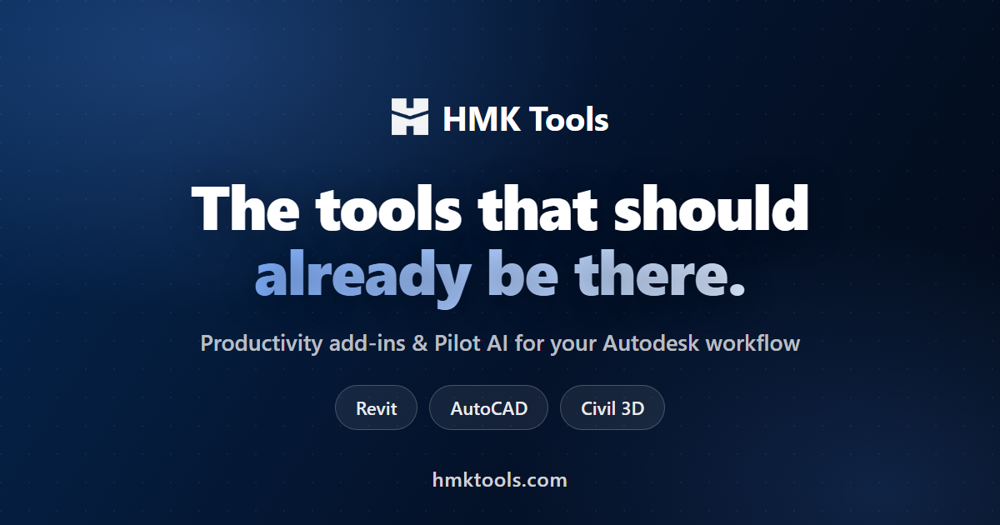

  

<h1 align="center">HMK Pilot — MCP for Revit, AutoCAD, Civil 3D &amp; Navisworks</h1>

  Drive your Autodesk apps from any MCP client, in plain language.

  
  
  
  
  

---

**HMK Pilot** runs a secure local MCP server **inside** your Autodesk application
and exposes **330+ real actions**, so an AI assistant can read and edit the *live*
model in plain language — not a stale export.

> Part of **[HMK Tools](https://hmktools.com)**.
> Full guide: **[hmktools.com/revit-mcp](https://hmktools.com/revit-mcp)** ·
> Comparison: **[vs other Revit MCP options](https://hmktools.com/revit-mcp-comparison)**

## What it does

- **Revit** — 100+ actions: select elements, edit parameters, create sheets, tag
  views, run clash checks, export IFC/NWC, drive Dynamo, and more. Also a
  built-in chat panel.
- **AutoCAD** — 80+ actions: draw & modify geometry, manage layers, blocks &
  xrefs, layouts and plotting to PDF.
- **Civil 3D** — 50+ additional actions: alignments, profiles, surfaces,
  corridors, pipe networks, sample lines & section views, COGO points.
- **Navisworks** — 90+ actions: search sets, clash detection, TimeLiner 4D,
  quantification, viewpoints, federation (append / merge / refresh / publish).
- Runs **100% locally** (bound to `localhost`) — your models and drawings never
  leave your machine.
- Optional Roslyn escape hatch — `execute_revit_code`, `execute_autocad_code`,
  `execute_civil_code`, `execute_navisworks_code` (toggle off in
  Settings → Security).

## Works with your assistant

Pilot AI speaks plain MCP, so anything that does will work. These are detected
and configured for you, one click each:

| Client | Config |
|---|---|
| **Claude Desktop** | JSON (both config locations) |
| **Claude Code** | JSON |
| **ChatGPT / Codex** | TOML |
| **Cursor** | JSON |
| **Google Antigravity** | JSON |
| **Windsurf** | JSON |
| **Gemini CLI** | JSON |
| **Qwen Code** | JSON |

Setup scans for the clients you actually have installed and writes only to
those. **Any MCP servers already in your config are preserved** — the writer
merges rather than replaces, and reports how many entries it left alone.

Running more than one Autodesk app, or several instances of the same one? Turn
on the **3-slot pool** and each instance gets its own server entry, so the
assistant can tell them apart instead of racing for a single port.

## Built-in domain knowledge

The connectors ship a knowledge base the assistant can pull on demand through
`get_knowledge_template` — verified API notes, workflow recipes, unit tables and
safety rules per application. It means the assistant reaches for a checked
pattern instead of guessing an API member and burning a round on the error.

It also **learns from your machine**. When a code call fails and a later one
succeeds, the working snippet and the error it stopped hitting are saved
locally, then offered back on similar work — including in a *later* session, and
across both the MCP server and the in-app chat panel. Nothing about this leaves
your computer.

## Requirements

- Windows (x64)
- Autodesk **Revit 2023–2027**, **AutoCAD / Civil 3D 2021–2027**, and/or
  **Navisworks Manage / Simulate 2023–2027**
- An MCP client from the table above (bring your own AI account)
- An **HMK Tools license** — free 30-day trial, no card
  ([pricing](https://hmktools.com/pricing))

> No Node.js, no Python, no separate runtime. The local bridge is a single
> native executable that ships with the add-in.

## Install

1. Download & install **HMK Tools** from
   **[hmktools.com/install](https://hmktools.com/install)**.
2. In Revit / AutoCAD / Civil 3D / Navisworks, open the **HMK Tools → Pilot AI**
   ribbon and toggle the **Connector** on.
3. Open **Settings → Setup Guide**, find your assistant in the list and click
   **Configure** — done. Restart the client so it picks up the new server.

Step-by-step with screenshots:
**[Getting started](https://hmktools.com/docs/getting-started)** ·
**[Connect a client](https://hmktools.com/docs/connect)**.

## Docs

- Getting started: <https://hmktools.com/docs/getting-started>
- Connect an MCP client: <https://hmktools.com/docs/connect>
- Asking for what you want: <https://hmktools.com/docs/how-to-ask>
- Troubleshooting: <https://hmktools.com/docs/troubleshooting>
- Per app — Revit: <https://hmktools.com/docs/revit> ·
  AutoCAD / Civil 3D: <https://hmktools.com/docs/autocad> ·
  Navisworks: <https://hmktools.com/docs/navisworks>

## Learn more

- How Revit MCP works: <https://hmktools.com/revit-mcp>
- AutoCAD & Civil 3D MCP: <https://hmktools.com/autocad-mcp>
- Navisworks + AI: <https://hmktools.com/navisworks-ai>
- Compare the options: <https://hmktools.com/revit-mcp-comparison>
- AI in Revit (guide): <https://hmktools.com/blog/ai-in-revit>
- Revit connector: <https://hmktools.com/toolbox/pilot-ai-revit>
- AutoCAD & Civil 3D connector: <https://hmktools.com/toolbox/pilot-cad>
- Navisworks connector: <https://hmktools.com/toolbox/navis-pilot>
- What changed, release by release: <https://hmktools.com/changelog>

## More from HMK Tools

HMK Pilot is one part of a 28-tool suite for Revit, AutoCAD, Civil 3D and
Navisworks — parameter automation, rebar, modeling, batch export and more.
Browse them all at **[hmktools.com/toolbox](https://hmktools.com/toolbox)**.

## Questions

This repository is an overview, not the source — issues here are welcome, but
the fastest route to a person is
**[hmktools.com/contact](https://hmktools.com/contact)**.

## License

Commercial — included with an **HMK Tools** license (free 30-day trial). This
repository is the public overview for the HMK Pilot MCP server; the server itself
ships inside the HMK Tools add-in.

---

Revit, AutoCAD, Civil 3D and Navisworks are trademarks of Autodesk, Inc. HMK
Tools is not affiliated with, endorsed by, or sponsored by Autodesk.
